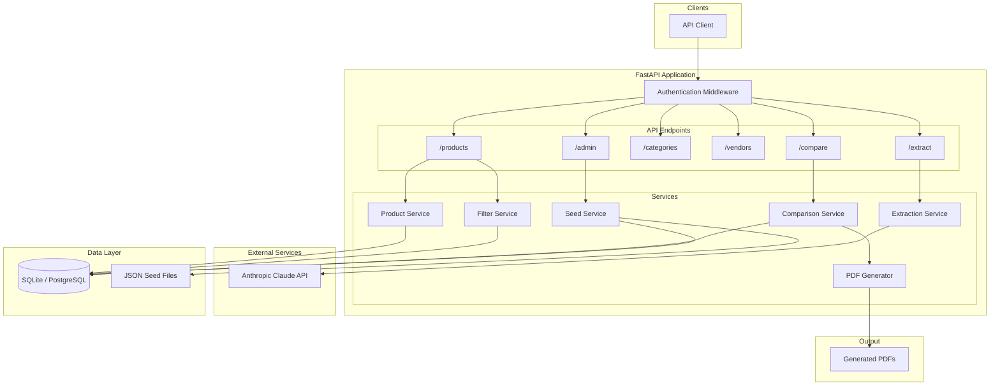
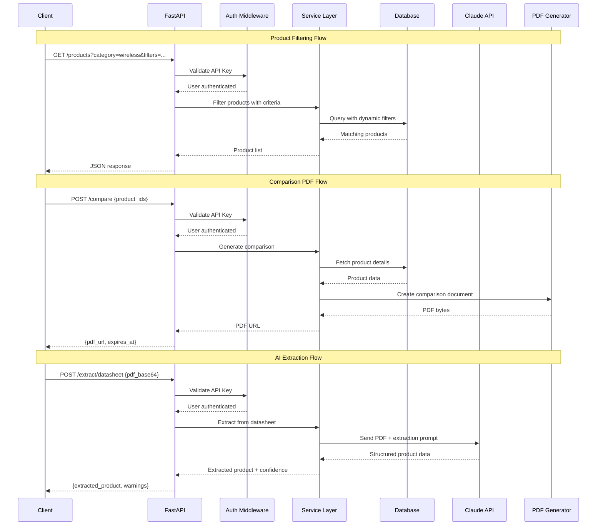
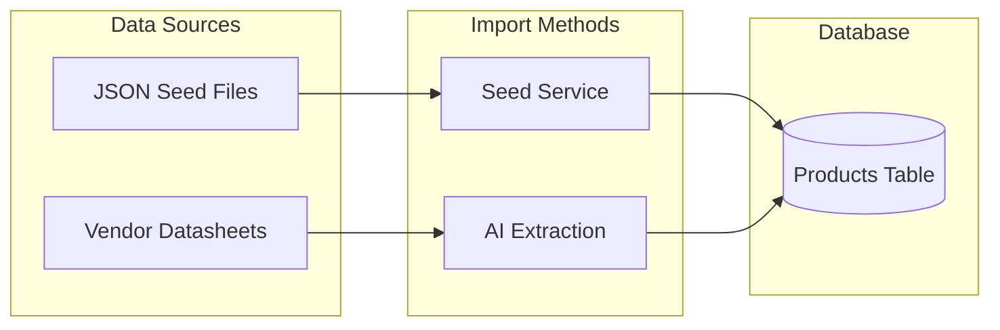
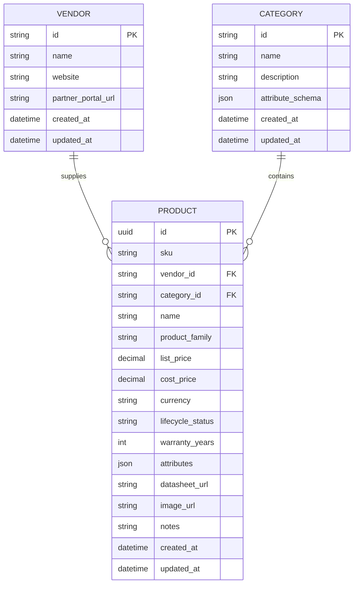

# VAR Product Intelligence Platform
## Technical Design Guide

**Version:** 1.0  
**Purpose:** A complete specification for building a product comparison and recommendation platform for Value-Added Resellers (VARs) selling network equipment across multiple vendors and product categories.

---

## 1. Executive Summary

### 1.1 What This Application Does

A unified product intelligence platform that enables pre-sales engineers to:

1. **Filter products** by technical specifications, pricing, and customer requirements across categories (wireless APs, firewalls, switches, routers, collaboration, servers)
2. **Compare products** across vendors (Cisco, Aruba, Meraki, Mist, Fortinet, Palo Alto, etc.)
3. **Generate PDF comparison documents** ready for customer delivery
4. **Extract product data** from vendor datasheets using AI

### 1.2 Technology Stack

| Component | Technology |
|-----------|------------|
| API Framework | FastAPI |
| Database | SQLite (dev) → PostgreSQL (prod) |
| Data Seeding | JSON files |
| AI/LLM | Anthropic Claude API |
| PDF Generation | ReportLab |
| Authentication | API Key (environment variables) |

---

## 2. System Architecture

### 2.1 High-Level Flow Diagram



### 2.2 Request Flow Diagram



### 2.3 Data Import Flow



---

## 3. Data Model

### 3.1 Entity Relationship



### 3.2 Core Entities

#### Vendor
- **id**: Unique identifier (e.g., "cisco", "aruba", "fortinet")
- **name**: Display name (e.g., "Cisco Systems")
- **website**: Vendor website URL
- **partner_portal_url**: Partner portal URL for your VAR access
- **timestamps**: Created and updated timestamps

#### Category
- **id**: Unique identifier (e.g., "wireless", "firewall", "switch")
- **name**: Display name (e.g., "Wireless Access Points")
- **description**: Category description
- **attribute_schema**: JSON Schema defining category-specific attributes (see Section 4)
- **timestamps**: Created and updated timestamps

#### Product
- **id**: UUID, auto-generated
- **sku**: Vendor SKU/part number
- **vendor_id**: Foreign key to Vendor
- **category_id**: Foreign key to Category
- **name**: Product name
- **product_family**: Product line (e.g., "Catalyst 9100 Series")
- **list_price**: MSRP
- **cost_price**: Your cost
- **currency**: Currency code (default "USD")
- **lifecycle_status**: "active", "end_of_sale", or "end_of_life"
- **warranty_years**: Warranty period
- **attributes**: JSON object containing category-specific attributes
- **datasheet_url**: Link to vendor datasheet
- **image_url**: Product image URL
- **notes**: Internal notes
- **timestamps**: Created and updated timestamps

---

## 4. Category Attribute Schemas

Each category has a defined schema for its `attributes` field. This enables type-safe filtering while maintaining flexibility across different product types.

### 4.1 Wireless Access Points

| Attribute | Type | Description | Example Values |
|-----------|------|-------------|----------------|
| wifi_generation | enum | WiFi standard | wifi5, wifi6, wifi6e, wifi7 |
| radio_config | string | MIMO configuration | "4x4:4", "8x8:8" |
| max_throughput_mbps | integer | Max throughput in Mbps | 9600 |
| concurrent_clients | integer | Max concurrent clients | 500, 1500 |
| bands | array | Supported frequency bands | ["2.4ghz", "5ghz", "6ghz"] |
| form_factor | enum | Deployment type | indoor, outdoor, ruggedized, wall_plate |
| uplink_speed | enum | Ethernet uplink | 1g, 2.5g, 5g, 10g |
| poe_requirement | enum | PoE standard required | 802.3af, 802.3at, 802.3bt |
| management_type | enum | Management model | cloud, controller, on_prem, standalone |
| subscription_required | boolean | Requires subscription | true/false |
| annual_subscription_cost | number | Annual license cost | 150.00 |
| wpa3_support | boolean | WPA3 support | true/false |
| iot_radios | array | Built-in IoT radios | ["ble", "zigbee", "thread"] |
| location_services | boolean | Location capabilities | true/false |
| ai_optimization | boolean | AI/ML RF optimization | true/false |

### 4.2 Firewalls

| Attribute | Type | Description | Example Values |
|-----------|------|-------------|----------------|
| firewall_throughput_gbps | number | Raw firewall throughput | 10.5 |
| threat_throughput_gbps | number | Throughput with UTM enabled | 3.2 |
| ipsec_vpn_throughput_gbps | number | VPN throughput | 5.0 |
| max_sessions | integer | Max concurrent sessions | 2000000 |
| new_sessions_per_sec | integer | New sessions per second | 150000 |
| interfaces | object | Port counts by speed | {1g_ports: 8, 10g_ports: 4} |
| form_factor | enum | Physical form | desktop, 1ru, 2ru, virtual |
| ha_support | boolean | High availability support | true/false |
| sd_wan_builtin | boolean | Built-in SD-WAN | true/false |
| management_type | enum | Management model | cloud, on_prem, hybrid |
| utm_features | array | Security features | ["antivirus", "ips", "url_filtering"] |
| subscription_bundles | array | License bundles | [{name, annual_cost, features}] |

### 4.3 Switches

| Attribute | Type | Description | Example Values |
|-----------|------|-------------|----------------|
| port_count | integer | Number of ports | 24, 48 |
| port_speed | enum | Port speed | 1g, 2.5g, 10g, 25g |
| uplink_ports | object | Uplink configuration | {count: 4, speed: "10g"} |
| poe_support | enum | PoE capability | none, 802.3af, 802.3at, 802.3bt |
| poe_budget_watts | integer | Total PoE budget | 740 |
| switching_capacity_gbps | number | Switching capacity | 176 |
| layer | enum | Layer capability | layer2, layer3_lite, layer3_full |
| stackable | boolean | Stacking support | true/false |
| max_stack_members | integer | Max stack size | 8 |
| form_factor | enum | Physical form | desktop, rack, industrial |
| management_type | enum | Management model | cloud, on_prem, smart_managed |
| fanless | boolean | Fanless design | true/false |

### 4.4 Routers

| Attribute | Type | Description | Example Values |
|-----------|------|-------------|----------------|
| routing_throughput_gbps | number | Routing throughput | 2.5 |
| wan_interfaces | array | WAN port types | [{type: "ethernet", count: 2}] |
| lan_ports | integer | LAN port count | 4 |
| sd_wan_support | boolean | SD-WAN capability | true/false |
| vpn_throughput_gbps | number | VPN throughput | 1.0 |
| concurrent_vpn_tunnels | integer | Max VPN tunnels | 500 |
| cellular_backup | boolean | LTE/5G backup | true/false |
| form_factor | enum | Physical form | desktop, rack, din_rail |

### 4.5 Collaboration

| Attribute | Type | Description | Example Values |
|-----------|------|-------------|----------------|
| device_type | enum | Endpoint type | room_kit, desk_phone, board, codec |
| camera_resolution | enum | Camera quality | 720p, 1080p, 4k |
| camera_field_of_view | integer | FOV in degrees | 120 |
| microphone_range_ft | integer | Mic pickup range | 20 |
| display_included | boolean | Includes display | true/false |
| display_size_inches | number | Display size | 55 |
| max_participants | integer | Max video participants | 25 |
| supported_platforms | array | Compatible platforms | ["webex", "zoom", "teams"] |
| touch_controller | boolean | Touch controller included | true/false |
| wireless_sharing | boolean | Wireless content sharing | true/false |
| room_size | enum | Recommended room | personal, small, medium, large |

### 4.6 Servers

| Attribute | Type | Description | Example Values |
|-----------|------|-------------|----------------|
| processor_family | string | CPU type | "Intel Xeon Scalable 4th Gen" |
| max_processors | integer | Max CPU sockets | 2 |
| max_cores | integer | Max core count | 128 |
| max_memory_tb | number | Max RAM | 4.0 |
| memory_slots | integer | DIMM slots | 32 |
| storage_bays | object | Drive bays by type | {sff_bays: 8, nvme_bays: 4} |
| max_storage_tb | number | Max storage capacity | 368 |
| pcie_slots | integer | PCIe slot count | 8 |
| form_factor | enum | Physical form | tower, 1ru, 2ru, blade |
| gpu_support | boolean | GPU capable | true/false |
| max_gpus | integer | Max GPU count | 4 |
| power_supplies | integer | PSU count | 2 |
| hot_swap_support | boolean | Hot-swap drives/PSU | true/false |

---

## 5. API Specification

### 5.1 Authentication

All endpoints require an API key passed in the `X-API-Key` header.

**Authentication Logic (Pseudo Code):**
```
FUNCTION verify_api_key(request_header):
    api_key = request_header.get("X-API-Key")
    
    FOR each environment_variable starting with "API_KEY_":
        IF environment_variable.value == api_key:
            RETURN username extracted from variable name
    
    RAISE unauthorized_error("Invalid API key")
```

**Environment Variable Format:**
- API_KEY_JOHN=abc123xyz
- API_KEY_SARAH=def456uvw

---

### 5.2 Endpoints Overview

| Method | Endpoint | Description |
|--------|----------|-------------|
| GET | /products | List and filter products |
| POST | /products | Create a new product |
| PUT | /products/{id} | Update a product |
| DELETE | /products/{id} | Delete a product |
| POST | /compare | Generate comparison PDF |
| GET | /compare/{id}/download | Download generated PDF |
| GET | /categories | List all categories |
| GET | /categories/{id} | Get category with schema |
| GET | /categories/{id}/filterable-attributes | Get filterable attributes |
| GET | /vendors | List all vendors |
| POST | /vendors | Create a vendor |
| POST | /extract/datasheet | AI extraction from PDF |
| POST | /admin/seed | Seed database from JSON |

---

### 5.3 Product Filtering

**GET /products**

Query Parameters:
- **skip**: Pagination offset (default: 0)
- **limit**: Page size (default: 50, max: 100)
- **category**: Category ID filter
- **vendor**: Vendor ID(s) filter (can be multiple)
- **lifecycle_status**: Status filter
- **min_price**: Minimum list price
- **max_price**: Maximum list price
- **attribute_filters**: JSON string of attribute filters
- **search**: Search in name, SKU, and product family
- **sort_by**: Sort field (name, list_price, sku, updated_at)
- **sort_order**: asc or desc

**Filter Logic (Pseudo Code):**
```
FUNCTION filter_products(params):
    query = SELECT * FROM products
    
    IF params.category:
        query = query.WHERE(category_id = params.category)
    
    IF params.vendor:
        query = query.WHERE(vendor_id IN params.vendor)
    
    IF params.min_price:
        query = query.WHERE(list_price >= params.min_price)
    
    IF params.max_price:
        query = query.WHERE(list_price <= params.max_price)
    
    IF params.attribute_filters:
        filters = parse_json(params.attribute_filters)
        FOR each key, value IN filters:
            IF value is array:
                query = query.WHERE(attributes->key IN value)
            ELSE:
                query = query.WHERE(attributes->key = value)
    
    IF params.search:
        query = query.WHERE(
            name LIKE search OR 
            sku LIKE search OR 
            product_family LIKE search
        )
    
    query = query.ORDER_BY(params.sort_by, params.sort_order)
    query = query.OFFSET(params.skip).LIMIT(params.limit)
    
    RETURN query.execute()
```

**Example Attribute Filter JSON:**
```
{
  "wifi_generation": "wifi6e",
  "form_factor": ["indoor", "outdoor"],
  "wpa3_support": true,
  "uplink_speed": ["2.5g", "5g", "10g"]
}
```

---

### 5.4 Comparison & PDF Generation

**POST /compare**

Request Body:
- **product_ids**: Array of product UUIDs (2-10 products)
- **include_pricing**: Boolean, include price columns (default: true)
- **include_attributes**: Array of attribute keys (empty = all)
- **title**: Optional custom title
- **notes**: Optional notes for the document

**Validation Rules:**
- All products must exist
- All products must be from the same category
- Minimum 2 products, maximum 10 products

**Comparison Logic (Pseudo Code):**
```
FUNCTION generate_comparison(request):
    products = fetch_products_by_ids(request.product_ids)
    
    IF products.count < 2:
        RAISE error("Minimum 2 products required")
    
    IF products.count > 10:
        RAISE error("Maximum 10 products allowed")
    
    categories = unique(products.map(p => p.category_id))
    IF categories.count > 1:
        RAISE error("All products must be from same category")
    
    category = fetch_category(categories[0])
    
    attributes_to_compare = request.include_attributes 
        OR get_all_attributes(category)
    
    pdf_bytes = generate_pdf(
        products: products,
        category: category,
        attributes: attributes_to_compare,
        include_pricing: request.include_pricing,
        title: request.title,
        notes: request.notes
    )
    
    comparison_id = generate_uuid()
    save_pdf_to_disk(comparison_id, pdf_bytes)
    
    RETURN {
        comparison_id: comparison_id,
        pdf_url: "/compare/{comparison_id}/download",
        expires_at: now() + 24 hours,
        products_compared: products.count
    }
```

---

### 5.5 AI Datasheet Extraction

**POST /extract/datasheet**

Request Body:
- **category_id**: Target category for extraction
- **vendor_id**: Vendor for the product
- **file_content**: Base64-encoded PDF
- **filename**: Original filename

**Extraction Logic (Pseudo Code):**
```
FUNCTION extract_from_datasheet(request):
    category = fetch_category(request.category_id)
    pdf_bytes = base64_decode(request.file_content)
    
    prompt = build_extraction_prompt(
        category_name: category.name,
        attribute_schema: category.attribute_schema
    )
    
    response = call_claude_api(
        model: "claude-sonnet-4-20250514",
        content: [
            {type: "document", data: pdf_bytes},
            {type: "text", text: prompt}
        ]
    )
    
    extracted_data = parse_json(response)
    
    confidence_score = calculate_confidence(extracted_data)
    
    product = build_product_from_extraction(
        extracted_data: extracted_data,
        vendor_id: request.vendor_id,
        category_id: request.category_id
    )
    
    RETURN {
        extraction_id: generate_uuid(),
        status: confidence_score > 0.7 ? "completed" : "partial",
        confidence_score: confidence_score,
        extracted_product: product,
        warnings: extracted_data.warnings,
        raw_extraction: extracted_data
    }
```

**Extraction Prompt Structure:**
```
You are a product data extraction specialist. Extract structured 
product information from the provided datasheet PDF.

Target Category: {category_name}

Expected Attributes Schema:
{attribute_schema as JSON}

Instructions:
1. Extract all fields matching the schema
2. For each field, provide value, confidence (high/medium/low), 
   and source location
3. Mark missing fields as null with explanation
4. Normalize values to schema format/units
5. Extract SKU, product name, and product family

Output as JSON with structure:
- sku, name, product_family
- attributes: {key: {value, confidence, source_note}}
- warnings: [list of issues]
```

---

## 6. PDF Output Specification

### 6.1 Document Structure

The comparison PDF follows this layout:

```
+----------------------------------------------------------+
|                    [Logo Placeholder]                      |
|                                                            |
|                   PRODUCT COMPARISON                       |
|                   {Category Name}                          |
|                                                            |
|                   Generated: {Date}                        |
|                   Prepared by: {Username}                  |
+----------------------------------------------------------+

+----------------------------------------------------------+
| OVERVIEW                                                   |
|                                                            |
| Comparing {N} products across {M} vendors                  |
+----------------------------------------------------------+

+----------------------------------------------------------+
| COMPARISON TABLE                                           |
|                                                            |
| +------------+----------+----------+----------+            |
| | Attribute  | Product1 | Product2 | Product3 |            |
| +------------+----------+----------+----------+            |
| | Vendor     | Cisco    | Aruba    | Meraki   |            |
| | SKU        | C9136I-B | R7J39A   | MR57     |            |
| | List Price | $1,695   | $1,495   | $1,499   |            |
| | WiFi Gen   | WiFi 6E  | WiFi 6E  | WiFi 6E  |            |
| | Throughput | 10.2 Gbps| 9.6 Gbps | 9.1 Gbps |            |
| | ...        | ...      | ...      | ...      |            |
| +------------+----------+----------+----------+            |
+----------------------------------------------------------+

+----------------------------------------------------------+
| NOTES                                                      |
|                                                            |
| - All prices are MSRP and subject to change               |
| - {Custom notes from request}                              |
+----------------------------------------------------------+

                        Page X of Y
```

### 6.2 PDF Generation Logic (Pseudo Code)

```
FUNCTION generate_pdf(products, category, attributes, include_pricing, title, notes):
    document = create_pdf_document(
        page_size: products.count > 3 ? LANDSCAPE : PORTRAIT,
        margins: 0.5 inches
    )
    
    content = []
    
    -- Title Section
    content.add(title_paragraph(title OR "Product Comparison"))
    content.add(subtitle_paragraph(category.name))
    content.add(metadata_paragraph("Generated: " + today()))
    content.add(spacer())
    
    -- Overview Section
    vendor_count = unique(products.map(p => p.vendor_id)).count
    content.add(section_header("Overview"))
    content.add(paragraph("Comparing {products.count} products across {vendor_count} vendors"))
    content.add(spacer())
    
    -- Build Comparison Table
    table_data = []
    
    -- Header Row
    header_row = ["Attribute"]
    FOR each product IN products:
        header_row.add(product.name)
    table_data.add(header_row)
    
    -- Vendor Row
    vendor_row = ["Vendor"]
    FOR each product IN products:
        vendor_row.add(product.vendor.name)
    table_data.add(vendor_row)
    
    -- SKU Row
    sku_row = ["SKU"]
    FOR each product IN products:
        sku_row.add(product.sku)
    table_data.add(sku_row)
    
    -- Price Row (if included)
    IF include_pricing:
        price_row = ["List Price"]
        FOR each product IN products:
            price_row.add(format_currency(product.list_price))
        table_data.add(price_row)
    
    -- Attribute Rows
    FOR each attribute_key IN attributes:
        row = [get_attribute_label(attribute_key)]
        FOR each product IN products:
            value = product.attributes.get(attribute_key)
            row.add(format_attribute_value(value))
        table_data.add(row)
    
    table = create_table(table_data)
    apply_table_styling(table)
    content.add(table)
    
    -- Notes Section
    IF notes:
        content.add(spacer())
        content.add(section_header("Notes"))
        content.add(paragraph(notes))
    
    content.add(footer("Page {page} of {total}"))
    
    document.build(content)
    RETURN document.as_bytes()
```

---

## 7. Data Seeding

### 7.1 JSON File Structure

```
/data/
├── vendors.json          # All vendor definitions
├── categories.json       # All category definitions with schemas
└── products/
    ├── wireless.json     # Wireless AP products
    ├── firewall.json     # Firewall products
    ├── switch.json       # Switch products
    ├── router.json       # Router products
    ├── collaboration.json # Collaboration products
    └── server.json       # Server products
```

### 7.2 File Formats

**vendors.json:**
```
{
  "vendors": [
    {
      "id": "cisco",
      "name": "Cisco Systems",
      "website": "https://www.cisco.com",
      "partner_portal_url": "https://partner.cisco.com"
    },
    ...
  ]
}
```

**categories.json:**
```
{
  "categories": [
    {
      "id": "wireless",
      "name": "Wireless Access Points",
      "description": "Enterprise wireless access points",
      "attribute_schema": { ... JSON Schema ... }
    },
    ...
  ]
}
```

**products/{category}.json:**
```
{
  "category_id": "wireless",
  "products": [
    {
      "sku": "C9136I-B",
      "vendor_id": "cisco",
      "name": "Cisco Catalyst 9136I Access Point",
      "product_family": "Catalyst 9100 Series",
      "list_price": 1695.00,
      "cost_price": 1017.00,
      "lifecycle_status": "active",
      "warranty_years": 1,
      "datasheet_url": "https://...",
      "attributes": {
        "wifi_generation": "wifi6e",
        "radio_config": "4x4:4",
        "max_throughput_mbps": 10200,
        ...
      }
    },
    ...
  ]
}
```

### 7.3 Seed Logic (Pseudo Code)

```
FUNCTION seed_database(seed_vendors, seed_categories, seed_products):
    IF seed_vendors:
        vendors = load_json("data/vendors.json")
        FOR each vendor IN vendors:
            upsert_vendor(vendor)
        LOG "Seeded {vendors.count} vendors"
    
    IF seed_categories:
        categories = load_json("data/categories.json")
        FOR each category IN categories:
            upsert_category(category)
        LOG "Seeded {categories.count} categories"
    
    IF seed_products:
        product_files = list_files("data/products/*.json")
        total_products = 0
        
        FOR each file IN product_files:
            data = load_json(file)
            category_id = data.category_id
            
            FOR each product IN data.products:
                product.category_id = category_id
                product.id = generate_uuid()
                upsert_product(product)
                total_products += 1
        
        LOG "Seeded {total_products} products"
    
    RETURN {
        vendors: vendors.count,
        categories: categories.count,
        products: total_products
    }
```

---

## 8. Project Structure

```
var-product-intelligence/
├── README.md
├── requirements.txt
├── .env.example
├── .gitignore
│
├── app/
│   ├── __init__.py
│   ├── main.py                 # FastAPI app entry point
│   ├── config.py               # Settings and configuration
│   ├── dependencies.py         # Dependency injection
│   │
│   ├── api/
│   │   ├── __init__.py
│   │   ├── products.py         # Product endpoints
│   │   ├── compare.py          # Comparison endpoints
│   │   ├── categories.py       # Category endpoints
│   │   ├── vendors.py          # Vendor endpoints
│   │   ├── extract.py          # AI extraction endpoints
│   │   └── admin.py            # Admin/seed endpoints
│   │
│   ├── models/
│   │   ├── __init__.py
│   │   ├── database.py         # Database setup
│   │   ├── vendor.py           # Vendor model
│   │   ├── category.py         # Category model
│   │   └── product.py          # Product model
│   │
│   ├── schemas/
│   │   ├── __init__.py
│   │   ├── vendor.py           # Vendor Pydantic schemas
│   │   ├── category.py         # Category Pydantic schemas
│   │   ├── product.py          # Product Pydantic schemas
│   │   ├── compare.py          # Comparison schemas
│   │   └── extract.py          # Extraction schemas
│   │
│   ├── services/
│   │   ├── __init__.py
│   │   ├── product_service.py  # Product business logic
│   │   ├── filter_service.py   # Dynamic query building
│   │   ├── comparison_service.py # Comparison logic
│   │   ├── pdf_generator.py    # PDF creation
│   │   ├── extraction_service.py # AI extraction
│   │   └── seed_service.py     # Database seeding
│   │
│   └── utils/
│       ├── __init__.py
│       └── auth.py             # API key validation
│
├── data/
│   ├── vendors.json
│   ├── categories.json
│   └── products/
│       ├── wireless.json
│       ├── firewall.json
│       ├── switch.json
│       ├── router.json
│       ├── collaboration.json
│       └── server.json
│
├── tests/
│   ├── __init__.py
│   ├── conftest.py
│   ├── test_products.py
│   ├── test_compare.py
│   ├── test_extract.py
│   └── test_filters.py
│
└── output/                     # Generated PDFs (gitignored)
    └── .gitkeep
```

---

## 9. Configuration

### 9.1 Environment Variables

| Variable | Description | Default |
|----------|-------------|---------|
| DATABASE_URL | Database connection string | sqlite:///./var_products.db |
| ANTHROPIC_API_KEY | Claude API key | (required) |
| PDF_OUTPUT_DIR | Directory for generated PDFs | ./output |
| PDF_EXPIRY_HOURS | Hours before PDF cleanup | 24 |
| HOST | Server host | 0.0.0.0 |
| PORT | Server port | 8000 |
| DEBUG | Debug mode | false |
| API_KEY_{USERNAME} | API keys for each user | (add as needed) |

### 9.2 Database Configuration

**Development (SQLite):**
- Single file database
- JSON stored as TEXT columns
- No additional setup required

**Production (PostgreSQL):**
- JSONB columns for attribute queries
- GIN indexes on attributes for performance
- Connection pooling recommended

---

## 10. Implementation Phases

### Phase 1: Foundation
- [ ] Project scaffolding
- [ ] Database models and SQLite setup
- [ ] Configuration management
- [ ] API key authentication
- [ ] Health check endpoint

### Phase 2: Data Layer
- [ ] Vendor CRUD endpoints
- [ ] Category CRUD with schemas
- [ ] Product CRUD with JSON attributes
- [ ] Seed service for JSON import
- [ ] Create initial seed data (5-10 products per category)

### Phase 3: Filtering & Query
- [ ] Dynamic filter service
- [ ] Product list with all filters
- [ ] Search functionality
- [ ] Sorting and pagination

### Phase 4: Comparison & PDF
- [ ] Comparison validation
- [ ] PDF generator service
- [ ] Comparison endpoint
- [ ] PDF download with expiry
- [ ] Cleanup job for expired PDFs

### Phase 5: AI Extraction
- [ ] Anthropic client setup
- [ ] Extraction prompt engineering
- [ ] Extraction endpoint
- [ ] Confidence scoring
- [ ] Schema validation

### Phase 6: Polish
- [ ] Error handling
- [ ] Request logging
- [ ] API documentation
- [ ] Unit tests
- [ ] Integration tests

---

## 11. Example API Workflows

### 11.1 Find WiFi 6E APs Under $1,500

```
GET /products
  ?category=wireless
  &max_price=1500
  &attribute_filters={"wifi_generation": "wifi6e"}
  &sort_by=list_price
  &sort_order=asc
```

### 11.2 Compare Three Products

```
POST /compare
{
  "product_ids": ["uuid-1", "uuid-2", "uuid-3"],
  "include_pricing": true,
  "title": "WiFi 6E Comparison for Acme Corp",
  "notes": "Customer needs outdoor coverage"
}
```

### 11.3 Extract from Datasheet

```
POST /extract/datasheet
{
  "category_id": "wireless",
  "vendor_id": "cisco",
  "file_content": "{base64-pdf}",
  "filename": "catalyst-9136-datasheet.pdf"
}
```

### 11.4 Seed Database

```
POST /admin/seed
  ?categories=true
  &vendors=true
  &products=true
```

---

## 12. Future Enhancements

Out of scope for MVP but planned for future:

1. **Web UI** - Frontend for non-API users
2. **User registration** - Self-service API keys
3. **Role-based access** - Admin, editor, viewer
4. **Bulk import** - CSV/Excel upload
5. **Vendor API sync** - Auto-update from distributors
6. **AI recommendations** - Suggest products based on requirements
7. **Proposal generation** - Full quote documents
8. **Price history** - Track changes over time
9. **Multi-tenant** - Support multiple VAR organizations
10. **Audit logging** - Track all changes

---

## 13. Glossary

| Term | Definition |
|------|------------|
| VAR | Value-Added Reseller |
| SKU | Stock Keeping Unit (vendor part number) |
| MSRP | Manufacturer's Suggested Retail Price |
| PoE | Power over Ethernet |
| UTM | Unified Threat Management |
| MIMO | Multiple Input Multiple Output |
| AP | Access Point |
| BOM | Bill of Materials |

---

*End of Design Document*
